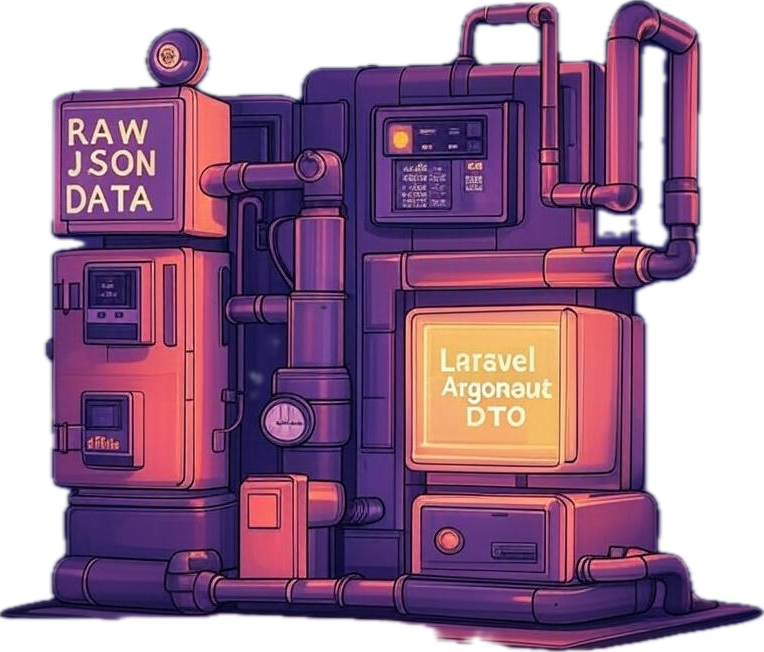

<br />
<br />
<div align="center">
  <a href="https://github.com/YorCreative">
    
  </a>
</div>
<h3 align="center">Laravel Argonaut DTO</h3>


<div align="center">
<a href="https://github.com/YorCreative/Laravel-Argonaut-DTO/blob/main/LICENSE.md"></a>
<a href="https://github.com/YorCreative/Laravel-Argonaut-DTO/stargazers"></a>

<a href="https://github.com/YorCreative/Laravel-Argonaut-DTO/issues"></a>
<a href="https://github.com/YorCreative/Laravel-Argonaut-DTO/network"></a>
<a href="https://github.com/YorCreative/Laravel-Argonaut-DTO/actions/workflows/phpunit-tests.yml"></a>
</div>

Laravel Argonaut DTO is a lightweight, highly composable package for transforming arrays, objects, or collections into structured DTOs (Data Transfer Objects), with built-in support for:

- 🧱 Deep nested transformation and casting
- 🔁 Type-safe data conversion
- ✅ Validation using Laravel’s validator
- 🧠 Explicit attribute prioritization
- 📦 Clean serialization (`toArray`, `toJson`)
- ♻️ Consistent data shape enforcement across boundaries

---

## 📦 Installation

Install via Composer:

```bash
composer require yorcreative/laravel-argonaut-dto
```

---

## 🚀 Quick Start

### 1. Define a DTO

DTOs extend `ArgonautDTO`, and define your expected structure via public properties, casting rules, and validation.

```php
class UserDTO extends ArgonautDTO
{
    public string $username;
    public string $email;

    protected array $casts = [
        'username' => 'string',
        'email' => 'string',
    ];

    public function rules(): array
    {
        return [
            'username' => ['required', 'string'],
            'email' => ['required', 'email'],
        ];
    }
}
```

This defines a strongly typed DTO with both validation rules and simple type casting.

---

### 2. Create an Assembler

Assemblers are responsible for mapping raw inputs (arrays or objects) into your DTOs.

```php
class UserDTOAssembler extends ArgonautAssembler
{
    public static function toUserDTO(object $input): UserDTO
    {
        return new UserDTO([
            'username' => $input->display_name,
            'email' => $input->email,
        ]);
    }
}
```

> Assembler method names must follow the format `to<ClassName>`, and are resolved automatically using `class_basename`.

---

### 3. Assemble a DTO

Use the assembler to transform raw data into structured, casted DTO instances.

```php
$dto = UserDTOAssembler::assemble([
    'display_name' => 'jdoe',
    'email' => 'jdoe@example.com',
], UserDTO::class);
```

You can also batch transform arrays or collections:

```php
UserDTOAssembler::fromArray($userArray, UserDTO::class);
UserDTOAssembler::fromCollection($userCollection, UserDTO::class);
```

---

## 🧪 Real-World Example: Product + Features + Reviews

This example demonstrates nested relationships and complex type casting in action.

### ProductDTO with nested casting:

```php
class ProductDTO extends ArgonautDTO
{
    public string $title;
    public array $features;
    public Collection $reviews;
    public ?UserDTO $user = null;

    protected array $casts = [
        'features' => [ProductFeatureDTO::class],
        'reviews' => Collection::class . ':' . ProductReviewDTO::class,
        'user' => UserDTO::class,
    ];

    public function rules(): array
    {
        return [
            'title' => ['required', 'string'],
            'reviews' => ['sometimes', 'required', 'collection', 'min:1'],
        ];
    }
}
```

### ProductDTOAssembler mapping input structure:

```php
class ProductDTOAssembler extends ArgonautAssembler
{
    public static function toProductDTO(object $input): ProductDTO
    {
        return new ProductDTO([
            'title' => $input->product_name,
            'user' => $input->user,
            'features' => $input->features ?? [],
            'reviews' => $input->reviews ?? [],
        ]);
    }

    public static function toProductFeatureDTO(object $input): ProductFeatureDTO
    {
        return new ProductFeatureDTO([
            'name' => $input->name ?? 'Unnamed Feature',
            'description' => $input->description ?? null,
        ]);
    }

    public static function toProductReviewDTO(object $input): ProductReviewDTO
    {
        return new ProductReviewDTO([
            'rating' => (int) ($input->rating ?? 0),
            'comment' => $input->comment ?? '',
        ]);
    }
}
```

---

## 🎯 DTOs with Prioritized Attributes and Custom Setters

ArgonautDTO allows you to prioritize the assignment of specific fields using `$prioritizedAttributes`, which is critical for cases where one field influences others.

```php
class UserDTO extends ArgonautDTO
{
    public ?string $firstName = null;
    public ?string $lastName = null;
    public string $username;
    public string $email;
    public ?string $fullName = null;

    protected array $prioritizedAttributes = ['firstName', 'lastName'];

    protected array $casts = [
        'firstName' => 'string',
        'lastName' => 'string',
        'username' => 'string',
        'email' => 'string',
        'fullName' => 'string',
    ];

    public function setFirstName($value)
    {
        $this->firstName = $value;
        $this->fullName = $this->firstName . ' ' . $this->lastName;
    }

    public function setLastName($value)
    {
        $this->lastName = $value;
        $this->fullName = $this->firstName . ' ' . $this->lastName;
    }

    public function rules(): array
    {
        return [
            'firstName' => ['nullable', 'string', 'max:32'],
            'lastName' => ['nullable', 'string', 'max:32'],
            'username' => ['required', 'string', 'max:64'],
            'email' => ['required', 'email', 'max:255'],
        ];
    }
}
```

---

## 🔁 Casting Reference

Casting allows you to automatically transform values into other DTOs, Laravel Collections, arrays, dates, and more.

```php
protected array $casts = [
    'registeredAt' => \Illuminate\Support\Carbon::class,
    'profile' => ProfileDTO::class,
    'roles' => [RoleDTO::class],
    'permissions' => Collection::class . ':' . PermissionDTO::class,
];
```

| Cast Type              | Example                                           | Description                          |
|------------------------|---------------------------------------------------|--------------------------------------|
| Scalar                 | `'string'`, `'int'`, etc.                         | Native PHP type cast                 |
| Single DTO             | `ProfileDTO::class`                               | Cast an array to a DTO instance      |
| Array of DTOs          | `[RoleDTO::class]`                                | Cast to array of DTOs                |
| Collection of DTOs     | `Collection::class . ':' . CommentDTO::class`     | Cast to a Laravel Collection         |
| Date casting           | `Carbon::class`                                   | Cast to Carbon/DateTime instance     |

---

## ✅ Validation

Validate DTOs with Laravel’s validator:

```php
$userDTO->validate();         // Throws ValidationException
$userDTO->validate(false);    // Returns array of errors (non-throwing)
$userDTO->isValid();          // Returns true/false
```

---

## 📤 Serialization

Serialize DTOs for output, API responses, etc.

```php
$userDTO->toArray(); // Recursively converts nested DTOs
$userDTO->toJson();  // JSON output (throws on encoding errors)
```

---

## 🛠️ DTO Collection Helper

Create DTO collections directly:

```php
UserDTO::collection([
    ['username' => 'john', 'email' => 'john@example.com'],
]);
```

---

## 🧪 Testing

Run the test suite using:

```bash
composer test
```

---

## 📚 Credits

- [Yorda](https://github.com/yordadev)
- [All Contributors](../../contributors)

---

## 📃 License

This package is open-sourced software licensed under the [MIT license](LICENSE).
